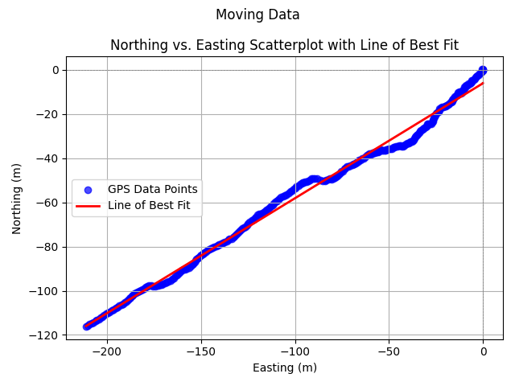

# GPS-Driver
This is a GPS ROS Driver package for USB GPS Driver BU-353S4


---
## The File Structure

### gnss/analysis
This folder contains the code for the analysis of the GNSS data.
### gnss/analysis/output
This folder contains the output files of the analysis.
### gnss/Report and Analysis
This folder contains the report and analysis of the assignment.
### gnss/data
This folder contains the ROS bag file of the GNSS data published as ros topic gps.
### gnss/gps_driver/src
This folder contains the code for the ROS driver of the GPS.
### gnss/gps_driver/launch
This folder contains the launch files for the ROS driver.
### gnss/gps_driver/msg
This folder contains the Custom GPS message definition for the ROS driver.

---

## Results of analysis



For more results refer to the [Analysis](analysis/Report%20and%20Analysis/Report.pdf)

## Running the Node

You can run the gps driver in two main ways:

### 1. Using the Launch File with the Default Port

To start the node with the default USB port, use the following command:

The default port is USB0

```bash
roslaunch gps_driver standalone_driver.launch
```

### 2. Overriding the Port Argument in the Launch File

If you want to specify a different USB port, you can override the port argument like this:

```bash
roslaunch gps_driver standalone_driver.launch port:=/dev/ttyUSB1
```

### 3. Running the Script Directly

You can also run the script directly and specify the port as a command-line argument:

terminal 1

```bash
roscore
```

terminal2 

```bash
rosrun gps_driver standalone_driver.py /dev/ttyUSB1
```

or 

```bash
python3 standalone_driver.py /dev/ttyUSB1
```

---

### Running the analysis scripts

To run the analysis scripts, navigate to the `analysis` folder and run the following commands:

#### One the terminal from the analysis folder and run all the analysis scripts

To run the entire stationary analysis 

```bash
python3 stationary_analysis_with_and_without_building.py
```

To run the entire moving analysis


```bash
python3 moving_data_analysis.py
```

To view the data collected from top of building

```bash
python3 stationary_analysis_with_building_on_top_open.py
```
uncommet the line 9 and comment the line 8 to view the second data collected on top of the building.

To view the plots serparately for data collected with buildings

```bash
python3 stationary_analysis_with_building.py
```

To view the  plots serparately for data collected without buildings

```bash
python3 stationary_analysis_without_building.py
```

---